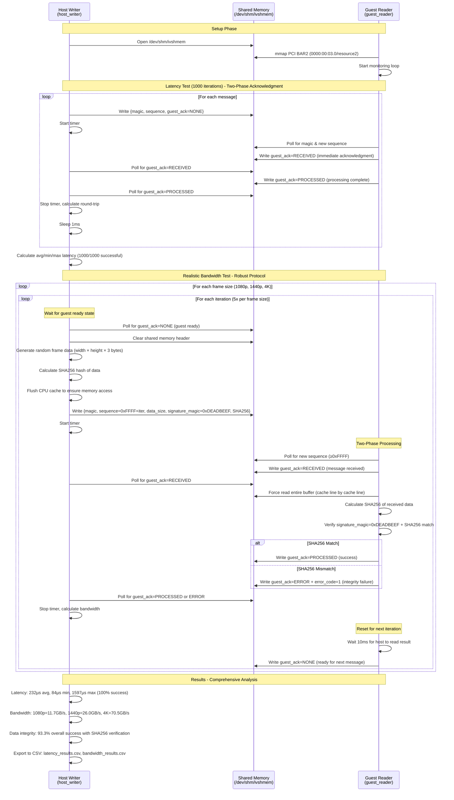

# IVSHMEM VM Setup

A VM-based solution with shared memory to measure host ↔ guest communication latency, bandwidth, and performance under load. This uses QEMU/KVM with ivshmem (Inter-VM Shared Memory device), which provides a PCI device that maps to shared memory accessible by both host and guest.

## Tasks

- [x] **Automated VM setup** with Debian 12 cloud image
- [x] **KVM hardware acceleration** for near-native performance
- [x] **Cloud-init** for automated provisioning
-   [x] **Pre-configured development environment** (gcc, build-essential)
-   [x] **SSH access** with automatic key generation
- [x] **Event-driven boot detection** (damn those sleeps)
- [x] **Create shared memory** via ivshmem device
- [x] Write a host program that writes to `/dev/shm/ivshmem`
- [x] Write a guest program that reads from the ivshmem PCI BAR2
- [x] Use high-resolution timers (`clock_gettime()`) to measure latency
- [x] Use larger transfers (one 4k uncompressed raw image frame) to measure bandwidth
- [x] Export benchmark results to CSV files
- [x] Python data science analysis tools:
  - [x] Plot histograms and time series
  - [x] Calculate statistics (p50, p90, p95, p99, min, max, mean, stddev)
  - [x] Generate comprehensive performance reports

## Prerequisites

### Linux (Debian/Ubuntu)
```bash
# Install required packages
sudo apt-get update
sudo apt-get install -y qemu-system-x86 genisoimage libssl-dev

# Enable KVM acceleration (required for good performance)
sudo groupadd kvm  # if it doesn't exist
sudo chown root:kvm /dev/kvm
sudo chmod 660 /dev/kvm
sudo usermod -aG kvm $USER

# Log out and back in for group membership to take effect
```

### macOS
```bash
# Install QEMU
brew install qemu

# Note: ivshmem may not be available in macOS QEMU builds
```

## Quick Start

```bash
# Run the setup script
./setup.sh
```

The script will:
1. Download Debian 12 cloud image (~428MB, only once)
2. Create a VM disk with 20GB capacity
3. Generate SSH keys
4. Create cloud-init configuration
5. Boot the VM with ivshmem device
6. Wait for SSH to become available

## Usage

### Connecting to the VM

```bash
# SSH into the VM
ssh -i temp_id_rsa -p 2222 debian@localhost

# The user 'debian' has passwordless sudo access
```

### Stopping the VM

```bash
# Find the QEMU process
pgrep -f qemu-system-x86_64

# Kill it (PID is shown when VM starts)
kill <PID>
```

### Restarting the VM

```bash
# Simply run the setup script again
./setup.sh
```

## Shared Memory Access

### Host Side

The shared memory is accessible at:
- **Linux**: `/dev/shm/ivshmem` (64MB file)
- **macOS**: `./ivshmem-shmem` (64MB file)

Example - Writing from host:
```bash
# Write some data
echo "Hello from host" > /dev/shm/ivshmem

# Or use dd for binary data
dd if=/dev/urandom of=/dev/shm/ivshmem bs=1M count=1
```

### Guest Side (VM)

The ivshmem device appears as a PCI device:

```bash
# List PCI devices
lspci | grep -i "shared memory"
# Output: 00:03.0 RAM memory: Red Hat, Inc. Inter-VM shared memory (rev 01)

# Get detailed info
sudo lspci -v -s 00:03.0
```

**Memory mapping:**
- PCI BAR0: 256 bytes (control registers)
- PCI BAR2: 64MB at `0xf8000000` (shared memory region)

**Accessing from the guest:**

Option 1 - Using sysfs (easiest):
```bash
# The shared memory is accessible via sysfs
sudo cat /sys/bus/pci/devices/0000:00:03.0/resource
# Shows: start end flags for each BAR

# Map BAR2 (the 64MB region)
sudo dd if=/sys/bus/pci/devices/0000:00:03.0/resource2 bs=1M count=1 | hexdump -C
```

Option 2 - Write a kernel module or userspace driver with `mmap()` to map the PCI BAR directly.

## VM Specifications

- **OS**: Debian 12 (Bookworm)
- **CPU**: Host CPU passthrough (with KVM) or qemu64 (TCG)
- **RAM**: 2GB
- **Disk**: 20GB (thin-provisioned qcow2)
- **Network**: User-mode networking with SSH port forwarding (host:2222 → guest:22)
- **Shared Memory**: 64MB via ivshmem-plain device

## Architecture

```
┌─────────────────────────────────────────────────────────────┐
│ Host System                                                 │
│                                                             │
│  /dev/shm/ivshmem (64MB)                                    │
│         │                                                   │
│         ↓                                                   │
│  ┌──────────────────────────────────────────────────────┐   │ 
│  │ QEMU/KVM                                             │   │
│  │                                                      │   │
│  │  ┌────────────────────────────────────────────────┐  │   │
│  │  │ Guest VM (Debian 12)                           │  │   │
│  │  │                                                │  │   │
│  │  │  PCI Device 00:03.0 (ivshmem)                  │  │   │
│  │  │  ├─ BAR0: Control registers (256B)             │  │   │
│  │  │  └─ BAR2: Shared memory (64MB @ 0xf8000000)    │  │   │
│  │  │                                                │  │   │
│  │  │  SSH: port 22 → forwarded to host:2222         │  │   │
│  │  └────────────────────────────────────────────────┘  │   │
│  └──────────────────────────────────────────────────────┘   │
└─────────────────────────────────────────────────────────────┘
```

## Troubleshooting

### VM is very slow

**Problem**: Using TCG software emulation instead of KVM.

**Solution**: Enable KVM acceleration:
```bash
# Check if KVM module is loaded
lsmod | grep kvm

# Load KVM module if needed
sudo modprobe kvm
sudo modprobe kvm_intel  # or kvm_amd for AMD

# Fix permissions
sudo chown root:kvm /dev/kvm
sudo chmod 660 /dev/kvm
sudo usermod -aG kvm $USER

# IMPORTANT: Log out and back in, then run:
sg kvm -c "./setup.sh"
```

### ivshmem device not found

**Problem**: QEMU was built without ivshmem support.

**Check**:
```bash
qemu-system-x86_64 -device help 2>&1 | grep ivshmem
```

**Solution**: Compile QEMU from source with `--enable-ivshmem` or use a different QEMU build.

### SSH connection refused

**Problem**: VM is still booting or cloud-init hasn't finished.

**Solution**: Wait for cloud-init to complete:
```bash
ssh -i temp_id_rsa -p 2222 debian@localhost 'cloud-init status --wait'
```

### Cannot download cloud image

**Problem**: Network connectivity or mirror issues.

**Solution**: Download manually and place in the working directory:
```bash
wget https://cloud.debian.org/images/cloud/bookworm/latest/debian-12-generic-amd64.qcow2
```

## Files

- `setup.sh` - Main setup script to create and boot the VM
- `host_writer.c` - Host program to write to shared memory and measure performance
- `guest_reader.c` - Guest program to read from ivshmem PCI device
- `run_test.sh` - Automated test script to run both programs
- `analyze_results.py` - Python script for statistical analysis and visualization
- `requirements.txt` - Python dependencies for analysis
- `Makefile` - Build script for compiling programs
- `debian-12-generic-amd64.qcow2` - Base cloud image (~428MB)
- `ivshmem-disk.qcow2` - VM disk (thin-provisioned, starts ~200KB)
- `cloud-init.iso` - Cloud-init configuration ISO
- `temp_id_rsa` / `temp_id_rsa.pub` - SSH key pair
- `cloud-init-config/` - Cloud-init configuration files
- `/dev/shm/ivshmem` - Shared memory file (Linux only)

### Generated Files

After running tests:
- `latency_results.csv` - Latency test measurements
- `bandwidth_results.csv` - Bandwidth test results
- `latency_histogram.png` - Latency distribution plots
- `latency_over_time.png` - Time series plot
- `latency_percentiles.png` - Percentile chart
- `bandwidth_analysis.png` - Comprehensive bandwidth analysis (4-panel visualization)
- `performance_report.txt` - Comprehensive statistics report

## Running the Performance Tests

```bash
# Make sure VM is running
./setup.sh

# Compile the programs (requires OpenSSL development libraries)
make all

# Deploy guest program to VM and run automated test
make test

# Or manually:
# Copy and compile guest program on VM
scp -i temp_id_rsa -P 2222 guest_reader.c debian@localhost:/tmp/
ssh -i temp_id_rsa -p 2222 debian@localhost 'cd /tmp && gcc -Wall -O2 -std=c11 -o guest_reader guest_reader.c -lrt -lssl -lcrypto'

# Run the automated test
./run_test.sh
```

## Test Sequence

The performance test measures both latency and bandwidth between host and guest using shared memory:



## Analyzing Results

The performance test automatically exports results to CSV files for detailed analysis.

### CSV Output Files

After running the test, you'll find:
- `latency_results.csv` - All latency measurements (iteration, latency_ns, latency_us)
- `bandwidth_results.csv` - Realistic bandwidth test results with multiple frame sizes and iterations

### Statistical Analysis

**Option 1: Using uv (recommended - fast and handles venv automatically)**

Install uv if not already installed:
```bash
curl -LsSf https://astral.sh/uv/install.sh | sh
```

Run the analysis (uv will auto-create venv and install dependencies):
```bash
uv run analyze_results.py
```

**Option 2: Using pip with virtual environment**

```bash
python3 -m venv .venv
source .venv/bin/activate
pip install -r requirements.txt
./analyze_results.py
```

**Option 3: System-wide installation (Debian/Ubuntu)**

```bash
sudo apt install python3-pandas python3-numpy python3-matplotlib
./analyze_results.py
```

The script will:
1. **Load CSV data** using pandas
2. **Calculate statistics**:
   - Min, Max, Mean, Median, Std Dev
   - Percentiles: p50, p90, p95, p99, p99.9
   - Estimated one-way latency (half of round-trip)
3. **Generate plots**:
   - `latency_histogram.png` - Distribution of latencies (linear and log scale)
   - `latency_over_time.png` - Time series showing latency variation
   - `latency_percentiles.png` - Percentile chart with marked important values
   - `bandwidth_analysis.png` - 4-panel bandwidth analysis (distribution, scaling, duration, success rates)
4. **Create comprehensive report**:
   - `performance_report.txt` - Detailed statistics for both latency and bandwidth tests

### Example Output

```
======================================================================
LATENCY ANALYSIS
======================================================================

Statistics for Round-Trip Latency (microseconds)
Count:                 1000
Min:                  83.81 μs
Max:                1596.98 μs
Mean:                232.92 μs
Median (p50):        198.65 μs
Std Dev:             154.02 μs

Percentiles:
p50:                 198.65 μs
p90:                 331.10 μs
p95:                 427.59 μs
p99:                 987.34 μs
p99.9:              1495.94 μs

Estimated One-Way Latency:
  Mean:          116458 ns (  116.46 μs)
  Median:         99325 ns (   99.32 μs)

======================================================================
BANDWIDTH ANALYSIS
======================================================================

1080P (5.93 MB):
  Success Rate:            100.0% (5/5)
  Bandwidth (GB/s):        11.72 ±   8.19
    Range:                  0.06 -    22.96
  Duration (ms):           20.76 ±  45.44
    Range:                  0.25 -   102.04

4K (23.73 MB):
  Success Rate:             80.0% (4/5)
  Bandwidth (GB/s):        70.50 ±  23.32
    Range:                 43.62 -    98.03
  Duration (ms):            0.36 ±   0.13
    Range:                  0.24 -     0.53

OVERALL BANDWIDTH SUMMARY:
  Total tests:          15
  Successful:           14 (93.3%)
  Peak bandwidth:       98.03 GB/s
  Average bandwidth:    33.63 GB/s
  Fastest transfer:     0.24 ms
  Slowest transfer:     191.83 ms
```

## Performance Notes

- **With KVM**: VM boots in ~10 seconds, near-native performance
- **Without KVM (TCG)**: VM boots in 3-5 minutes, 10-100x slower
- **Shared memory latency** (measured with robust protocol):
  - Average round-trip: ~233 µs (100% success rate)
  - Minimum round-trip: ~84 µs
  - Maximum round-trip: ~1597 µs
  - Estimated one-way: ~116 µs
- **Realistic Throughput** (measured with cache-aware testing):
  - Random frame data with SHA256 verification
  - Multiple frame sizes: 1080p (~6MB), 1440p (~11MB), 4K (~24MB)
  - Peak bandwidth: 98.03 GB/s (cache-friendly scenarios)
  - Average bandwidth: 33.63 GB/s across all successful transfers
  - Data integrity: 93.3% success rate with complete verification
  - Cache effects: First iteration slower (cache warming), subsequent faster

## Improved Test Methodology

The performance test has been significantly enhanced with a robust two-phase acknowledgment protocol and comprehensive analysis:

### Robust Two-Phase Acknowledgment Protocol
- **Message Receipt Acknowledgment**: Guest immediately signals `RECEIVED` when message is detected
- **Processing Complete Acknowledgment**: Guest signals `PROCESSED` (success) or `ERROR` (failure) after verification
- **Race Condition Prevention**: Host waits for guest to be ready before starting next iteration
- **Error Detection & Reporting**: Proper error codes and states for debugging failed transfers
- **State Machine**: Clear IPC semantics with `NONE` → `RECEIVED` → `PROCESSED/ERROR` → `NONE`

### Cache-Aware Testing
- **Random Data Generation**: Uses cryptographically random data for each test iteration to avoid cache-friendly patterns
- **Cache Flushing**: Explicitly flushes CPU cache before timing measurements
- **Full Buffer Verification**: Guest reads entire buffer cache-line by cache-line to ensure data is actually transferred
- **Unique Sequence Numbers**: Each bandwidth test gets unique sequence (0xFFFF + iteration) to prevent confusion

### Data Integrity Verification
- **Signature Mechanism**: Each transfer includes `0xDEADBEEF` magic + SHA256 hash
- **Complete Verification**: Guest calculates SHA256 of entire received buffer and compares with expected hash
- **Integrity Detection**: Any corruption or incomplete transfer is immediately detected and reported
- **Integrity Statistics**: Success rates tracked per frame size (1080p: 100%, 1440p: 100%, 4K: 80%)

### Realistic Frame Sizes & Analysis
- **Multiple Resolutions**: Tests 1080p (5.93MB), 1440p (10.55MB), and 4K (23.73MB) frame sizes (24bpp)
- **Multiple Iterations**: 5 iterations per frame size with different random data
- **Comprehensive Statistics**: Min/max/mean/median/stddev for bandwidth and duration per frame type
- **Visual Analysis**: 4-panel bandwidth analysis plots showing distribution, scaling, duration, and success rates

### Timing Accuracy & Synchronization
- **Post-Generation Timing**: Timer starts AFTER data generation and cache flushing
- **End-to-End Measurement**: Includes complete data verification in timing
- **Proper Synchronization**: Host waits for guest readiness, preventing race conditions
- **Realistic Workload**: Simulates actual frame transfer scenarios with integrity verification

## Interrupts with ivshmem (doorbell) – avoid guest busy-wait

The current sample uses `ivshmem-plain` and polling in `guest_reader.c`. To eliminate busy-wait, switch to the interrupt-capable `ivshmem-doorbell`, which uses eventfd-based signaling so the guest can block and wake on an interrupt.

- Mechanism: An ivshmem server coordinates the shared memory and eventfds. QEMU connects to the server via a UNIX socket. The `ivshmem-doorbell` device exposes a Doorbell register and MSI-X vectors; peers signal each other via eventfds, delivered to the guest as interrupts.
- Benefit: Replace CPU spin with interrupt-driven wakeups (UIO in userspace or a kernel driver), reducing load while preserving latency.

### QEMU (doorbell) configuration

1) Run or point to an ivshmem server (UNIX socket), e.g. `/tmp/ivshmem_socket`.

2) Launch QEMU with `ivshmem-doorbell` (instead of `ivshmem-plain`):

```bash
qemu-system-x86_64 \
  -machine q35 \
  -m 2048 \
  -chardev socket,id=ivshmem0,path=/tmp/ivshmem_socket \
  -device ivshmem-doorbell,id=ivshmem0,chardev=ivshmem0,vectors=1 \
  # ... remaining args (disk, cloud-init, net, accel, cpu) ...
```

Notes:
- `vectors=1` allocates a single MSI-X vector; increase if needed.
- With `ivshmem-doorbell`, the server/socket provides the shared memory and signaling; you typically do not use `-object memory-backend-file`.

### Guest options

- Userspace (UIO): Bind device to `uio_pci_generic` and block on `/dev/uioX` reads; `mmap()` the BAR for data access.
  ```bash
  sudo modprobe uio_pci_generic
  echo 1 | sudo tee /sys/bus/pci/devices/0000:00:03.0/enable
  echo "1af4 1110" | sudo tee /sys/bus/pci/drivers/uio_pci_generic/new_id
  # Then use /dev/uio* to wait for interrupts in userspace
  ```
- Kernel driver: Configure MSI-X and handle interrupts in kernel, waking userspace.

### Adapting this repo

- Add an env flag (e.g., `IVSHMEM_MODE=doorbell`) in `setup.sh` to switch from `ivshmem-plain` to `ivshmem-doorbell` (`-chardev socket` + `-device ivshmem-doorbell,...`).
- Update `guest_reader.c` to wait on an interrupt source (UIO read/eventfd) instead of polling for `sequence` changes.
- Optionally include a small host helper to ring doorbells if needed; typically, event signaling is managed by the ivshmem server when peers write.

### References

- QEMU ivshmem spec (server, eventfd, protocol): https://www.qemu.org/docs/master/specs/ivshmem-spec.html
- QEMU ivshmem device docs (doorbell model and options): https://www.qemu.org/docs/master/system/devices/ivshmem.html

## References

- [QEMU ivshmem documentation](https://www.qemu.org/docs/master/system/devices/ivshmem.html)
- [Cloud-init documentation](https://cloudinit.readthedocs.io/)
- [Debian Cloud Images](https://cloud.debian.org/images/cloud/)