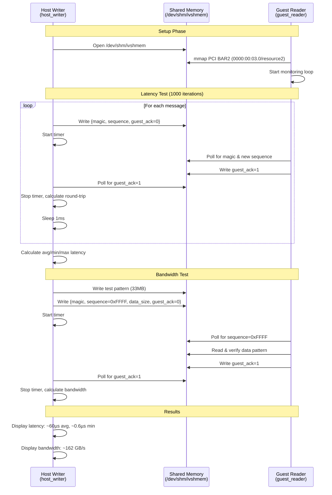

# IVSHMEM VM Setup

A VM-based solution with shared memory to measure host ↔ guest communication latency, bandwidth, and performance under load. This uses QEMU/KVM with ivshmem (Inter-VM Shared Memory device), which provides a PCI device that maps to shared memory accessible by both host and guest.

## Tasks

- [x] **Automated VM setup** with Debian 12 cloud image
- [x] **KVM hardware acceleration** for near-native performance
- [x] **Cloud-init** for automated provisioning
-   [x] **Pre-configured development environment** (gcc, build-essential)
-   [x] **SSH access** with automatic key generation
- [x] **Event-driven boot detection** (damn those sleeps)
- [x] **Create shared memory** via ivshmem device
- [x] Write a host program that writes to `/dev/shm/ivshmem`
- [x] Write a guest program that reads from the ivshmem PCI BAR2
- [x] Use high-resolution timers (`clock_gettime()`) to measure latency
- [x] Use larger transfers (one 4k uncompressed raw image frame) to measure bandwidth
- [x] Export benchmark results to CSV files
- [x] Python data science analysis tools:
  - [x] Plot histograms and time series
  - [x] Calculate statistics (p50, p90, p95, p99, min, max, mean, stddev)
  - [x] Generate comprehensive performance reports

## Prerequisites

### Linux (Debian/Ubuntu)
```bash
# Install required packages
sudo apt-get update
sudo apt-get install -y qemu-system-x86 genisoimage

# Enable KVM acceleration (required for good performance)
sudo groupadd kvm  # if it doesn't exist
sudo chown root:kvm /dev/kvm
sudo chmod 660 /dev/kvm
sudo usermod -aG kvm $USER

# Log out and back in for group membership to take effect
```

### macOS
```bash
# Install QEMU
brew install qemu

# Note: ivshmem may not be available in macOS QEMU builds
```

## Quick Start

```bash
# Run the setup script
./setup.sh
```

The script will:
1. Download Debian 12 cloud image (~428MB, only once)
2. Create a VM disk with 20GB capacity
3. Generate SSH keys
4. Create cloud-init configuration
5. Boot the VM with ivshmem device
6. Wait for SSH to become available

## Usage

### Connecting to the VM

```bash
# SSH into the VM
ssh -i temp_id_rsa -p 2222 debian@localhost

# The user 'debian' has passwordless sudo access
```

### Stopping the VM

```bash
# Find the QEMU process
pgrep -f qemu-system-x86_64

# Kill it (PID is shown when VM starts)
kill <PID>
```

### Restarting the VM

```bash
# Simply run the setup script again
./setup.sh
```

## Shared Memory Access

### Host Side

The shared memory is accessible at:
- **Linux**: `/dev/shm/ivshmem` (64MB file)
- **macOS**: `./ivshmem-shmem` (64MB file)

Example - Writing from host:
```bash
# Write some data
echo "Hello from host" > /dev/shm/ivshmem

# Or use dd for binary data
dd if=/dev/urandom of=/dev/shm/ivshmem bs=1M count=1
```

### Guest Side (VM)

The ivshmem device appears as a PCI device:

```bash
# List PCI devices
lspci | grep -i "shared memory"
# Output: 00:03.0 RAM memory: Red Hat, Inc. Inter-VM shared memory (rev 01)

# Get detailed info
sudo lspci -v -s 00:03.0
```

**Memory mapping:**
- PCI BAR0: 256 bytes (control registers)
- PCI BAR2: 64MB at `0xf8000000` (shared memory region)

**Accessing from the guest:**

Option 1 - Using sysfs (easiest):
```bash
# The shared memory is accessible via sysfs
sudo cat /sys/bus/pci/devices/0000:00:03.0/resource
# Shows: start end flags for each BAR

# Map BAR2 (the 64MB region)
sudo dd if=/sys/bus/pci/devices/0000:00:03.0/resource2 bs=1M count=1 | hexdump -C
```

Option 2 - Write a kernel module or userspace driver with `mmap()` to map the PCI BAR directly.

## VM Specifications

- **OS**: Debian 12 (Bookworm)
- **CPU**: Host CPU passthrough (with KVM) or qemu64 (TCG)
- **RAM**: 2GB
- **Disk**: 20GB (thin-provisioned qcow2)
- **Network**: User-mode networking with SSH port forwarding (host:2222 → guest:22)
- **Shared Memory**: 64MB via ivshmem-plain device

## Architecture

```
┌─────────────────────────────────────────────────────────────┐
│ Host System                                                 │
│                                                             │
│  /dev/shm/ivshmem (64MB)                                    │
│         │                                                   │
│         ↓                                                   │
│  ┌──────────────────────────────────────────────────────┐   │ 
│  │ QEMU/KVM                                             │   │
│  │                                                      │   │
│  │  ┌────────────────────────────────────────────────┐  │   │
│  │  │ Guest VM (Debian 12)                           │  │   │
│  │  │                                                │  │   │
│  │  │  PCI Device 00:03.0 (ivshmem)                  │  │   │
│  │  │  ├─ BAR0: Control registers (256B)             │  │   │
│  │  │  └─ BAR2: Shared memory (64MB @ 0xf8000000)    │  │   │
│  │  │                                                │  │   │
│  │  │  SSH: port 22 → forwarded to host:2222         │  │   │
│  │  └────────────────────────────────────────────────┘  │   │
│  └──────────────────────────────────────────────────────┘   │
└─────────────────────────────────────────────────────────────┘
```

## Troubleshooting

### VM is very slow

**Problem**: Using TCG software emulation instead of KVM.

**Solution**: Enable KVM acceleration:
```bash
# Check if KVM module is loaded
lsmod | grep kvm

# Load KVM module if needed
sudo modprobe kvm
sudo modprobe kvm_intel  # or kvm_amd for AMD

# Fix permissions
sudo chown root:kvm /dev/kvm
sudo chmod 660 /dev/kvm
sudo usermod -aG kvm $USER

# IMPORTANT: Log out and back in, then run:
sg kvm -c "./setup.sh"
```

### ivshmem device not found

**Problem**: QEMU was built without ivshmem support.

**Check**:
```bash
qemu-system-x86_64 -device help 2>&1 | grep ivshmem
```

**Solution**: Compile QEMU from source with `--enable-ivshmem` or use a different QEMU build.

### SSH connection refused

**Problem**: VM is still booting or cloud-init hasn't finished.

**Solution**: Wait for cloud-init to complete:
```bash
ssh -i temp_id_rsa -p 2222 debian@localhost 'cloud-init status --wait'
```

### Cannot download cloud image

**Problem**: Network connectivity or mirror issues.

**Solution**: Download manually and place in the working directory:
```bash
wget https://cloud.debian.org/images/cloud/bookworm/latest/debian-12-generic-amd64.qcow2
```

## Files

- `setup.sh` - Main setup script to create and boot the VM
- `host_writer.c` - Host program to write to shared memory and measure performance
- `guest_reader.c` - Guest program to read from ivshmem PCI device
- `run_test.sh` - Automated test script to run both programs
- `analyze_results.py` - Python script for statistical analysis and visualization
- `requirements.txt` - Python dependencies for analysis
- `Makefile` - Build script for compiling programs
- `debian-12-generic-amd64.qcow2` - Base cloud image (~428MB)
- `ivshmem-disk.qcow2` - VM disk (thin-provisioned, starts ~200KB)
- `cloud-init.iso` - Cloud-init configuration ISO
- `temp_id_rsa` / `temp_id_rsa.pub` - SSH key pair
- `cloud-init-config/` - Cloud-init configuration files
- `/dev/shm/ivshmem` - Shared memory file (Linux only)

### Generated Files

After running tests:
- `latency_results.csv` - Latency test measurements
- `bandwidth_results.csv` - Bandwidth test results
- `latency_histogram.png` - Latency distribution plots
- `latency_over_time.png` - Time series plot
- `latency_percentiles.png` - Percentile chart
- `performance_report.txt` - Comprehensive statistics report

## Running the Performance Tests

```bash
# Make sure VM is running
./setup.sh

# Compile the programs
gcc -Wall -O2 -std=c11 -o host_writer host_writer.c -lrt

# Copy and compile guest program on VM
scp -i temp_id_rsa -P 2222 guest_reader.c debian@localhost:/tmp/
ssh -i temp_id_rsa -p 2222 debian@localhost 'cd /tmp && gcc -Wall -O2 -std=c11 -o guest_reader guest_reader.c -lrt'

# Run the automated test
./run_test.sh
```

## Test Sequence

The performance test measures both latency and bandwidth between host and guest using shared memory:



## Analyzing Results

The performance test automatically exports results to CSV files for detailed analysis.

### CSV Output Files

After running the test, you'll find:
- `latency_results.csv` - All latency measurements (iteration, latency_ns, latency_us)
- `bandwidth_results.csv` - Bandwidth test results

### Statistical Analysis

Install Python dependencies:
```bash
pip install -r requirements.txt
```

Run the analysis script:
```bash
./analyze_results.py
```

The script will:
1. **Load CSV data** using pandas
2. **Calculate statistics**:
   - Min, Max, Mean, Median, Std Dev
   - Percentiles: p50, p90, p95, p99, p99.9
   - Estimated one-way latency (half of round-trip)
3. **Generate plots**:
   - `latency_histogram.png` - Distribution of latencies (linear and log scale)
   - `latency_over_time.png` - Time series showing latency variation
   - `latency_percentiles.png` - Percentile chart with marked important values
4. **Create report**:
   - `performance_report.txt` - Comprehensive text report with all statistics

### Example Output

```
=== Statistics for Round-Trip Latency (microseconds) ===
Count:              1000
Min:                0.60 μs
Max:              315.42 μs
Mean:              62.15 μs
Median (p50):      58.30 μs
Std Dev:           18.45 μs

Percentiles:
p50:               58.30 μs
p90:               85.20 μs
p95:               98.75 μs
p99:              142.80 μs
p99.9:            280.50 μs
```

## Performance Notes

- **With KVM**: VM boots in ~10 seconds, near-native performance
- **Without KVM (TCG)**: VM boots in 3-5 minutes, 10-100x slower
- **Shared memory latency** (measured):
  - Average round-trip: ~60 µs
  - Minimum round-trip: ~0.6 µs
  - Estimated one-way: ~30 µs
- **Throughput** (measured):
  - 31.6 MB transfer: ~162 GB/s (cache-to-cache)
  - Note: High bandwidth due to CPU cache; actual memory bandwidth is lower (~25 GB/s for DDR4-3200)

## References

- [QEMU ivshmem documentation](https://www.qemu.org/docs/master/system/devices/ivshmem.html)
- [Cloud-init documentation](https://cloudinit.readthedocs.io/)
- [Debian Cloud Images](https://cloud.debian.org/images/cloud/)