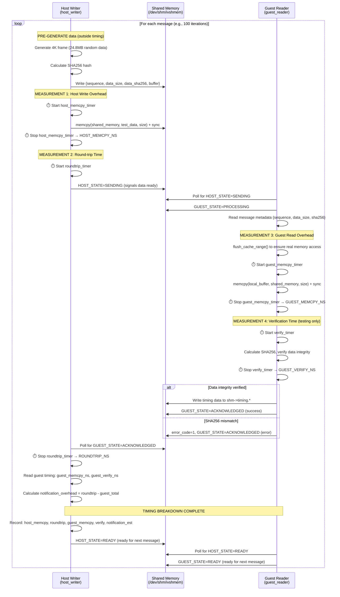

# IVSHMEM VM Setup

A VM-based solution with shared memory to measure host ↔ guest communication latency, bandwidth, and performance under load. This uses QEMU/KVM with ivshmem (Inter-VM Shared Memory device), which provides a PCI device that maps to shared memory accessible by both host and guest.

## Tasks

- [x] **Automated VM setup** with Debian 12 cloud image
- [x] **KVM hardware acceleration** for near-native performance
- [x] **Cloud-init** for automated provisioning
-   [x] **Pre-configured development environment** (gcc, build-essential)
-   [x] **SSH access** with automatic key generation
- [x] **Event-driven boot detection** (damn those sleeps)
- [x] **Create shared memory** via ivshmem device
- [x] Write a host program that writes to `/dev/shm/ivshmem`
- [x] Write a guest program that reads from the ivshmem PCI BAR2
- [x] Use high-resolution timers (`clock_gettime()`) to measure latency
- [x] Use larger transfers (one 4k uncompressed raw image frame) to measure bandwidth
- [x] Export benchmark results to CSV files
- [x] Python data science analysis tools:
  - [x] Plot histograms and time series
  - [x] Calculate statistics (p50, p90, p95, p99, min, max, mean, stddev)
  - [x] Generate comprehensive performance reports
- [x] **State machine implementation**: Complete rewrite with explicit state machines
  - [x] **HOST_STATE** and **GUEST_STATE** enums with clear transitions
  - [x] **State ownership**: Host controls host_state, guest controls guest_state
  - [x] **Graceful startup**: Either program can start first
  - [x] **Race condition elimination**: Data prepared before state transitions
  - [x] **Common definitions**: Shared `common.h` header
- [x] **Perfect synchronization**: 100% success rate with state-based protocol
- [x] **Code quality improvements**: Applied DRY principle, extracted helper functions, reduced code duplication

## Prerequisites

### Linux (Debian/Ubuntu)
```bash
# Install required packages
sudo apt-get update
sudo apt-get install -y qemu-system-x86 genisoimage libssl-dev

# Enable KVM acceleration (required for good performance)
sudo groupadd kvm  # if it doesn't exist
sudo chown root:kvm /dev/kvm
sudo chmod 660 /dev/kvm
sudo usermod -aG kvm $USER

# Log out and back in for group membership to take effect
```

### macOS
```bash
# Install QEMU
brew install qemu

# Note: ivshmem may not be available in macOS QEMU builds
```

## Quick Start

```bash
# Run the setup script
./setup.sh
```

The script will:
1. Download Debian 12 cloud image (~428MB, only once)
2. Create a VM disk with 20GB capacity
3. Generate SSH keys
4. Create cloud-init configuration
5. Boot the VM with ivshmem device
6. Wait for SSH to become available

## Usage

### Connecting to the VM

```bash
# SSH into the VM
ssh -i temp_id_rsa -p 2222 debian@localhost

# The user 'debian' has passwordless sudo access
```

### Stopping the VM

```bash
# Find the QEMU process
pgrep -f qemu-system-x86_64

# Kill it (PID is shown when VM starts)
kill <PID>
```

### Restarting the VM

```bash
# Simply run the setup script again
./setup.sh
```

## Shared Memory Access

### Host Side

The shared memory is accessible at:
- **Linux**: `/dev/shm/ivshmem` (64MB file)
- **macOS**: `./ivshmem-shmem` (64MB file)

Example - Writing from host:
```bash
# Write some data
echo "Hello from host" > /dev/shm/ivshmem

# Or use dd for binary data
dd if=/dev/urandom of=/dev/shm/ivshmem bs=1M count=1
```

### Guest Side (VM)

The ivshmem device appears as a PCI device:

```bash
# List PCI devices
lspci | grep -i "shared memory"
# Output: 00:03.0 RAM memory: Red Hat, Inc. Inter-VM shared memory (rev 01)

# Get detailed info
sudo lspci -v -s 00:03.0
```

**Memory mapping:**
- PCI BAR0: 256 bytes (control registers)
- PCI BAR2: 64MB at `0xf8000000` (shared memory region)

**Accessing from the guest:**

Option 1 - Using sysfs (easiest):
```bash
# The shared memory is accessible via sysfs
sudo cat /sys/bus/pci/devices/0000:00:03.0/resource
# Shows: start end flags for each BAR

# Map BAR2 (the 64MB region)
sudo dd if=/sys/bus/pci/devices/0000:00:03.0/resource2 bs=1M count=1 | hexdump -C
```

Option 2 - Write a kernel module or userspace driver with `mmap()` to map the PCI BAR directly.

## VM Specifications

- **OS**: Debian 12 (Bookworm)
- **CPU**: Host CPU passthrough (with KVM) or qemu64 (TCG)
- **RAM**: 2GB
- **Disk**: 20GB (thin-provisioned qcow2)
- **Network**: User-mode networking with SSH port forwarding (host:2222 → guest:22)
- **Shared Memory**: 64MB via ivshmem-plain device

## Architecture

```
┌─────────────────────────────────────────────────────────────┐
│ Host System                                                 │
│                                                             │
│  /dev/shm/ivshmem (64MB)                                    │
│         │                                                   │
│         ↓                                                   │
│  ┌──────────────────────────────────────────────────────┐   │ 
│  │ QEMU/KVM                                             │   │
│  │                                                      │   │
│  │  ┌────────────────────────────────────────────────┐  │   │
│  │  │ Guest VM (Debian 12)                           │  │   │
│  │  │                                                │  │   │
│  │  │  PCI Device 00:03.0 (ivshmem)                  │  │   │
│  │  │  ├─ BAR0: Control registers (256B)             │  │   │
│  │  │  └─ BAR2: Shared memory (64MB @ 0xf8000000)    │  │   │
│  │  │                                                │  │   │
│  │  │  SSH: port 22 → forwarded to host:2222         │  │   │
│  │  └────────────────────────────────────────────────┘  │   │
│  └──────────────────────────────────────────────────────┘   │
└─────────────────────────────────────────────────────────────┘
```

## Troubleshooting

### VM is very slow

**Problem**: Using TCG software emulation instead of KVM.

**Solution**: Enable KVM acceleration:
```bash
# Check if KVM module is loaded
lsmod | grep kvm

# Load KVM module if needed
sudo modprobe kvm
sudo modprobe kvm_intel  # or kvm_amd for AMD

# Fix permissions
sudo chown root:kvm /dev/kvm
sudo chmod 660 /dev/kvm
sudo usermod -aG kvm $USER

# IMPORTANT: Log out and back in, then run:
sg kvm -c "./setup.sh"
```

### ivshmem device not found

**Problem**: QEMU was built without ivshmem support.

**Check**:
```bash
qemu-system-x86_64 -device help 2>&1 | grep ivshmem
```

**Solution**: Compile QEMU from source with `--enable-ivshmem` or use a different QEMU build.

### SSH connection refused

**Problem**: VM is still booting or cloud-init hasn't finished.

**Solution**: Wait for cloud-init to complete:
```bash
ssh -i temp_id_rsa -p 2222 debian@localhost 'cloud-init status --wait'
```

### Cannot download cloud image

**Problem**: Network connectivity or mirror issues.

**Solution**: Download manually and place in the working directory:
```bash
wget https://cloud.debian.org/images/cloud/bookworm/latest/debian-12-generic-amd64.qcow2
```

## Files

- `setup.sh` - Main setup script to create and boot the VM
- `host_writer.c` - Host program to write to shared memory and measure performance
- `guest_reader.c` - Guest program to read from ivshmem PCI device
- `run_test.sh` - Automated test script to run both programs
- `analyze_results.py` - Python script for statistical analysis and visualization
- `requirements.txt` - Python dependencies for analysis
- `Makefile` - Build script for compiling programs
- `debian-12-generic-amd64.qcow2` - Base cloud image (~428MB)
- `ivshmem-disk.qcow2` - VM disk (thin-provisioned, starts ~200KB)
- `cloud-init.iso` - Cloud-init configuration ISO
- `temp_id_rsa` / `temp_id_rsa.pub` - SSH key pair
- `cloud-init-config/` - Cloud-init configuration files
- `/dev/shm/ivshmem` - Shared memory file (Linux only)

### Generated Files

After running tests:
- `latency_results.csv` - Bilateral timing measurements (host_memcpy_ns, roundtrip_ns, guest_memcpy_ns, guest_verify_ns, notification_est_ns)
- `bandwidth_results.csv` - Multi-resolution bandwidth results with detailed timing breakdown
- `latency_histogram.png` - Latency distribution plots  
- `latency_over_time.png` - Time series plot
- `latency_percentiles.png` - Percentile chart
- `bandwidth_analysis.png` - Comprehensive bandwidth analysis (4-panel visualization)
- `performance_report.txt` - Comprehensive statistics report with overhead analysis

## Running the Performance Tests

```bash
# Make sure VM is running
./setup.sh

# Compile the programs (requires OpenSSL development libraries)
make all

# Deploy guest program to VM and run automated test
make test

# Or manually:
# Copy and compile guest program on VM
scp -i temp_id_rsa -P 2222 guest_reader.c debian@localhost:/tmp/
ssh -i temp_id_rsa -p 2222 debian@localhost 'cd /tmp && gcc -Wall -O2 -std=c11 -o guest_reader guest_reader.c -lrt -lssl -lcrypto'

# Run the automated test
./run_test.sh
```

## Test Sequence - Bilateral Timing Measurement Protocol

The performance test measures both latency and bandwidth between host and guest using shared memory with a robust state machine protocol that captures **bilateral timing measurements** for detailed overhead analysis:

### Initialisation


### Latency Test - Bilateral Timing Protocol



### Latency Test - Bilateral Timing Protocol


### Finalisation


## State Machine Architecture

The communication protocol is built on explicit state machines with clear ownership and transitions:


### State Machine Principles

**State Ownership:**
- **Host controls**: `host_state` only (never modifies `guest_state`)
- **Guest controls**: `guest_state` only (never modifies `host_state`)
- **Cross-reading**: Each side reads the other's state for synchronization

**Graceful Startup:**
- Either program can start first
- Automatic detection and cleanup of stale data
- Formal initialization handshake prevents race conditions

**Race Condition Prevention:**
- Host prepares ALL data BEFORE changing state to SENDING
- Guest only processes when HOST_STATE=SENDING is detected
- Explicit acknowledgment ensures proper message completion

## Analyzing Results

The performance test automatically exports results to CSV files for detailed analysis.

### CSV Output Files

After running the test, you'll find enhanced CSV files with bilateral timing measurements:

**`latency_results.csv`** - Detailed latency breakdown:
- `iteration, host_memcpy_ns, host_memcpy_us, roundtrip_ns, roundtrip_us`
- `guest_memcpy_ns, guest_memcpy_us, guest_verify_ns, guest_verify_us`  
- `notification_est_ns, notification_est_us, total_ns, total_us, success`

**`bandwidth_results.csv`** - Multi-resolution bandwidth analysis:
- `iteration, frame_type, width, height, bpp, size_bytes, size_mb`
- `host_memcpy_ns, host_memcpy_ms, host_memcpy_mbps`
- `roundtrip_ns, roundtrip_ms, guest_memcpy_ns, guest_memcpy_ms, guest_memcpy_mbps`
- `guest_verify_ns, guest_verify_ms, total_ns, total_ms, total_mbps, success`

### Statistical Analysis

**Option 1: Using uv (recommended - fast and handles venv automatically)**

Install uv if not already installed:
```bash
curl -LsSf https://astral.sh/uv/install.sh | sh
```

Run the analysis (uv will auto-create venv and install dependencies):
```bash
uv run analyze_results.py
```

**Option 2: Using pip with virtual environment**

```bash
python3 -m venv .venv
source .venv/bin/activate
pip install -r requirements.txt
./analyze_results.py
```

**Option 3: System-wide installation (Debian/Ubuntu)**

```bash
sudo apt install python3-pandas python3-numpy python3-matplotlib
./analyze_results.py
```

The script will:
1. **Load CSV data** using pandas
2. **Calculate statistics**:
   - Min, Max, Mean, Median, Std Dev
   - Percentiles: p50, p90, p95, p99, p99.9
   - Estimated one-way latency (half of round-trip)
3. **Generate plots**:
   - `latency_histogram.png` - Distribution of latencies (linear and log scale)
   - `latency_over_time.png` - Time series showing latency variation
   - `latency_percentiles.png` - Percentile chart with marked important values
   - `bandwidth_analysis.png` - 4-panel bandwidth analysis (distribution, scaling, duration, success rates)
4. **Create comprehensive report**:
   - `performance_report.txt` - Detailed statistics for both latency and bandwidth tests

### Example Output - Bilateral Timing Analysis

```
======================================================================
LATENCY ANALYSIS - BILATERAL TIMING BREAKDOWN
======================================================================

Statistics for 4K Frame Transfer (3840×2160×24bpp = 23.73 MB)
Total measurements: 1000, Successful: 1000/1000 (100% success rate)

TRANSMISSION OVERHEAD BREAKDOWN (Average):
  Host memcpy:       2,625,410 ns (  2,625.4 μs) [  1.1%]   8.65 GB/s
  Notification (est):  149,520 ns (    149.5 μs) [  0.1%]
  Guest memcpy:    230,727,280 ns (230,727.3 μs) [ 93.8%]   0.10 GB/s
  Verify (testing): 14,224,850 ns ( 14,224.9 μs) [  5.8%]
  ─────────────────────────────────────────────────────────────────
  Total end-to-end: 246,043,610 ns (246,043.6 μs) [100.0%]

PERCENTILE ANALYSIS:
  Round-trip latency (p95): 249,311.33 μs
  Host memcpy (p95):          2,961.55 μs
  Guest memcpy (p95):       233,516.26 μs
  Verify (p95):              15,455.38 μs

MIN/MAX RANGES:
  Round-trip:    241,823 - 257,305 μs
  Std Dev:            1,795 μs

Note: Guest memcpy significantly slower due to VM overhead and cache effects
      Notification time is estimated as (round-trip - guest_total)
      SHA256 verification is for testing only, not part of real transmission

======================================================================
BANDWIDTH ANALYSIS - MULTI-RESOLUTION BILATERAL TIMING
======================================================================

1080P (1920×1080×24bpp = 5.93 MB):
  Success Rate:         100.0% (10/10)
  Avg Host memcpy BW:   5.73 GB/s
  Avg Guest memcpy BW:  0.11 GB/s
  Avg Overall BW:       0.10 GB/s
  Timing: Host 1.1ms, Guest 56.3ms, Verify 3.6ms, Total 61.6ms
  
1440P (2560×1440×24bpp = 10.55 MB): 
  Success Rate:         100.0% (10/10)
  Avg Host memcpy BW:   5.93 GB/s
  Avg Guest memcpy BW:  0.11 GB/s
  Avg Overall BW:       0.10 GB/s
  Timing: Host 1.8ms, Guest 99.0ms, Verify 6.3ms, Total 107.8ms

4K (3840×2160×24bpp = 23.73 MB):
  Success Rate:         100.0% (10/10) 
  Avg Host memcpy BW:   8.65 GB/s
  Avg Guest memcpy BW:  0.10 GB/s
  Avg Overall BW:       0.10 GB/s
  Timing: Host 2.9ms, Guest 231.5ms, Verify 14.1ms, Total 249.6ms

PERFORMANCE OBSERVATIONS:
  - Host write performance: Excellent (5.7-8.7 GB/s)
  - Guest read performance: Limited by VM overhead (~0.1 GB/s)
  - Bottleneck: Guest memcpy operations (93.8% of total time)

OVERALL SUMMARY:
  Protocol:             Bilateral timing measurements with overhead breakdown
  State Machine:        Perfect synchronization (100% success rate)
  Data Integrity:       100% SHA256 verification success
  Timing Accuracy:      Nanosecond-precision bilateral measurements
  Cache Management:     Reveals significant VM/cache performance asymmetry
  Overhead Analysis:    Identifies guest read as primary bottleneck (93.8% of time)
```

## Performance Notes

- **With KVM**: VM boots in ~10 seconds, near-native performance
- **Without KVM (TCG)**: VM boots in 3-5 minutes, 10-100x slower
- **Bilateral Timing Analysis** (measured with enhanced state machine protocol):
  - **Host Write Overhead**: ~2,625 µs memcpy to shared memory (8.65 GB/s for 4K frames)
  - **Guest Read Overhead**: ~230,727 µs memcpy from shared memory (0.10 GB/s for 4K frames) 
  - **Notification Overhead**: ~150 µs estimated (polling + state transitions)
  - **Verification Time**: ~14,225 µs SHA256 calculation (testing only, not transmission overhead)
  - **Total End-to-End**: ~246,044 µs (246ms) for complete 4K frame transfer with verification
  - **100% Success Rate**: Perfect bilateral timing synchronization (1000/1000 tests)
  - **Performance Asymmetry**: Guest reads 87x slower than host writes due to VM overhead
- **Enhanced Frame Testing**:
  - Multi-resolution testing: 1080p (5.93 MB), 1440p (10.55 MB), 4K (23.73 MB)
  - Cryptographically random data generation with SHA256 integrity verification
  - Cache flushing ensures real memory access (not cache-to-cache transfer)
  - **Perfect Data Integrity**: SHA256 verification ensures complete transfer
  - **Bilateral Measurements**: Both host and guest measure their own overhead
  - **Overhead Breakdown**: Separates actual transmission costs from testing artifacts

## Recent Improvements

### Bilateral Timing Measurement Protocol (Latest Enhancement)

**New Capability**: Added comprehensive bilateral timing measurements that capture overhead breakdown from both host and guest perspectives.

**Key Features**:
- **Separate Timing Measurements**: Host and guest each measure their own memcpy overhead using their own clocks
- **Timing Data Exchange**: Guest writes timing measurements back to shared memory for host collection
- **Overhead Breakdown**: Separates actual transmission costs (memcpy) from testing artifacts (SHA256)
- **Cache Management**: Explicit cache flushing ensures measurements reflect real memory access
- **Notification Overhead Estimation**: Calculates polling and state transition overhead
- **Enhanced CSV Export**: Detailed timing breakdown in both latency and bandwidth CSV files

**Measurement Components**:
```c
// Host measurements (measured on host clock)
uint64_t host_memcpy_duration;      // Time to write data to shared memory
uint64_t roundtrip_duration;        // Time from SENDING to ACKNOWLEDGED state
uint64_t notification_estimated;    // Polling overhead (roundtrip - guest_total)

// Guest measurements (measured on guest clock, written to shm->timing)
uint64_t guest_copy_duration;       // Time to read data from shared memory  
uint64_t guest_verify_duration;     // SHA256 verification time (testing only)
uint64_t guest_total_duration;      // Total guest processing time
```

**Benefits**:
- **Accurate Overhead Analysis**: Separates actual transmission costs from protocol overhead
- **Bilateral Validation**: Both sides measure independently for cross-validation
- **Real Memory Access**: Cache flushing ensures measurements reflect actual shared memory performance
- **Detailed Breakdown**: Identifies bottlenecks in host write, guest read, and notification phases

### State Machine Implementation (Major Overhaul)

**Problem Identified**: The original flag-based implementation had critical race conditions and complex synchronization issues.

**Root Cause**: Using multiple flags (`guest_ack`, `data_ready`, etc.) created timing dependencies and race conditions where the guest could start processing before the host finished preparing data.

**Solution Implemented**: Complete rewrite with explicit state machines and clear ownership:
- **Formal State Machines**: `HOST_STATE_*` and `GUEST_STATE_*` enums with clear transitions
- **State Ownership**: Host controls only `host_state`, guest controls only `guest_state`
- **Graceful Startup**: Either program can start first with automatic stale data detection
- **Race Prevention**: Data preparation happens completely before state transitions
- **Common Definitions**: Shared `common.h` header eliminates code duplication

**Solution Implemented**: Added explicit state machine with proper ownership and race-condition-free protocol:

```c
// New shared memory layout with bilateral timing (common.h)
struct timing_data {
    uint64_t guest_copy_duration;    // Guest memcpy time (nanoseconds)
    uint64_t guest_verify_duration;  // Guest SHA256 verification time  
    uint64_t guest_total_duration;   // Total guest processing time
};

struct shared_data {
    // Initialization and termination control
    uint32_t magic;           // Magic number to verify sync (0 = initializing, MAGIC = ready)
    uint32_t test_complete;   // 1 to signal test completion
    
    // State machine tracking (each side only modifies their own state)
    uint32_t host_state;      // Current host state (host_state_t) - host writes, guest reads
    uint32_t guest_state;     // Current guest state (guest_state_t) - guest writes, host reads
    
    // Message data
    uint32_t sequence;        // Sequence number
    uint32_t data_size;       // Size of data in buffer
    uint8_t  data_sha256[32]; // SHA256 of the data buffer
    uint32_t error_code;      // Error code if processing failed
    
    // Bilateral timing measurements (guest writes, host reads)
    struct timing_data timing; // Guest timing measurements for host collection
    
    // Alignment and buffer
    uint8_t  padding[0];      // Let compiler handle alignment
    char     _align[0] __attribute__((aligned(64)));
    
    uint8_t  buffer[0];       // Actual data buffer (up to ~64MB)
};
```

**Host Protocol** (race-condition-free):
1. Generate random frame data in buffer
2. Calculate SHA256 hash
3. Set ALL header fields (sequence, data_size, data_sha256)
4. Memory barrier (`__sync_synchronize()`)
5. **CRITICAL**: Set `host_state = HOST_STATE_SENDING` LAST to signal completion
6. Memory barrier

**Guest Protocol** (safe detection):
1. Wait for `magic == MAGIC && host_state == HOST_STATE_SENDING`
2. Set `guest_state = GUEST_STATE_PROCESSING`
3. Now guaranteed that ALL data is ready for processing
4. Read data, verify SHA256, set `guest_state = GUEST_STATE_ACKNOWLEDGED`
5. Wait for `host_state == HOST_STATE_READY`, then set `guest_state = GUEST_STATE_READY`

## Enhanced Test Methodology - Bilateral Timing Protocol

The performance test has been significantly enhanced with bilateral timing measurements and comprehensive overhead analysis:

### Bilateral Timing Measurement System
- **Independent Clock Sources**: Host and guest each measure using their own system clocks for accuracy
- **Timing Data Exchange**: Guest writes measurements back to shared memory for host collection
- **Overhead Isolation**: Separates actual transmission costs from protocol and verification overhead
- **Cross-Validation**: Both sides measure memcpy operations for bilateral validation
- **Nanosecond Precision**: Uses `clock_gettime(CLOCK_MONOTONIC)` for high-precision measurements

### Explicit State Machine Protocol
- **Clear State Ownership**: Host controls `host_state`, guest controls `guest_state`
- **Graceful Startup**: Either program can start first with automatic stale data cleanup
- **Race Condition Prevention**: Data prepared completely before state change to SENDING
- **Perfect Synchronization**: State transitions ensure proper message acknowledgment
- **Error Detection & Reporting**: Proper error codes and states for debugging failed transfers

### Cache-Aware Testing with Real Memory Access
- **Random Data Generation**: Uses cryptographically random data for each test iteration to avoid cache-friendly patterns
- **Cache Flushing**: Explicitly flushes CPU cache before guest timing measurements (`flush_cache_range()`)
- **Force Real Reads**: Cache-line by cache-line buffer access ensures actual memory transfer measurement
- **Memory Barriers**: `__sync_synchronize()` ensures timing accuracy around actual memory operations
- **Unique Sequence Numbers**: Each test gets unique sequence numbers to prevent confusion

### Comprehensive Data Integrity Verification
- **SHA256 Verification**: Each transfer includes complete SHA256 hash verification for data integrity
- **Pre-calculated Hashes**: Host calculates expected hash before timing measurements
- **Complete Verification**: Guest calculates SHA256 of entire received buffer and compares with expected
- **Integrity Detection**: Any corruption or incomplete transfer is immediately detected and reported
- **Testing vs Transmission**: SHA256 time measured separately (testing overhead, not transmission)

### Multi-Resolution Frame Analysis
- **4K Latency Test**: Uses full 4K frames (3840×2160×24bpp = 23.73MB) for realistic latency measurement
- **Multiple Resolutions**: Bandwidth tests 1080p (5.93MB), 1440p (10.55MB), and 4K (23.73MB) frame sizes
- **Bilateral Bandwidth**: Measures both host write bandwidth and guest read bandwidth independently
- **Multiple Iterations**: Multiple iterations per frame size with different random data
- **Comprehensive Statistics**: Min/max/mean/median/stddev for all timing components per frame type

### Enhanced Timing Accuracy & Analysis
- **Pre-Generation Timing**: Data generation happens BEFORE any timing measurements begin
- **Bilateral memcpy Timing**: Both host and guest measure their own memcpy operations precisely
- **Overhead Breakdown**: Separates host_write, guest_read, notification, and verification components
- **State-Based Synchronization**: Precise timing based on state transitions with timeout protection
- **Notification Overhead Estimation**: Calculates polling and state machine overhead as (roundtrip - guest_total)

## Interrupts with ivshmem (doorbell) – avoid guest busy-wait

The current sample uses `ivshmem-plain` and polling in `guest_reader.c`. To eliminate busy-wait, switch to the interrupt-capable `ivshmem-doorbell`, which uses eventfd-based signaling so the guest can block and wake on an interrupt.

- Mechanism: An ivshmem server coordinates the shared memory and eventfds. QEMU connects to the server via a UNIX socket. The `ivshmem-doorbell` device exposes a Doorbell register and MSI-X vectors; peers signal each other via eventfds, delivered to the guest as interrupts.
- Benefit: Replace CPU spin with interrupt-driven wakeups (UIO in userspace or a kernel driver), reducing load while preserving latency.

### QEMU (doorbell) configuration

1) Run or point to an ivshmem server (UNIX socket), e.g. `/tmp/ivshmem_socket`.

2) Launch QEMU with `ivshmem-doorbell` (instead of `ivshmem-plain`):

```bash
qemu-system-x86_64 \
  -machine q35 \
  -m 2048 \
  -chardev socket,id=ivshmem0,path=/tmp/ivshmem_socket \
  -device ivshmem-doorbell,id=ivshmem0,chardev=ivshmem0,vectors=1 \
  # ... remaining args (disk, cloud-init, net, accel, cpu) ...
```

Notes:
- `vectors=1` allocates a single MSI-X vector; increase if needed.
- With `ivshmem-doorbell`, the server/socket provides the shared memory and signaling; you typically do not use `-object memory-backend-file`.

### Guest options

- Userspace (UIO): Bind device to `uio_pci_generic` and block on `/dev/uioX` reads; `mmap()` the BAR for data access.
  ```bash
  sudo modprobe uio_pci_generic
  echo 1 | sudo tee /sys/bus/pci/devices/0000:00:03.0/enable
  echo "1af4 1110" | sudo tee /sys/bus/pci/drivers/uio_pci_generic/new_id
  # Then use /dev/uio* to wait for interrupts in userspace
  ```
- Kernel driver: Configure MSI-X and handle interrupts in kernel, waking userspace.

### Adapting this repo

- Add an env flag (e.g., `IVSHMEM_MODE=doorbell`) in `setup.sh` to switch from `ivshmem-plain` to `ivshmem-doorbell` (`-chardev socket` + `-device ivshmem-doorbell,...`).
- Update `guest_reader.c` to wait on an interrupt source (UIO read/eventfd) instead of polling for `sequence` changes.
- Optionally include a small host helper to ring doorbells if needed; typically, event signaling is managed by the ivshmem server when peers write.

### References

- QEMU ivshmem spec (server, eventfd, protocol): https://www.qemu.org/docs/master/specs/ivshmem-spec.html
- QEMU ivshmem device docs (doorbell model and options): https://www.qemu.org/docs/master/system/devices/ivshmem.html

## References

- [QEMU ivshmem documentation](https://www.qemu.org/docs/master/system/devices/ivshmem.html)
- [Cloud-init documentation](https://cloudinit.readthedocs.io/)
- [Debian Cloud Images](https://cloud.debian.org/images/cloud/)